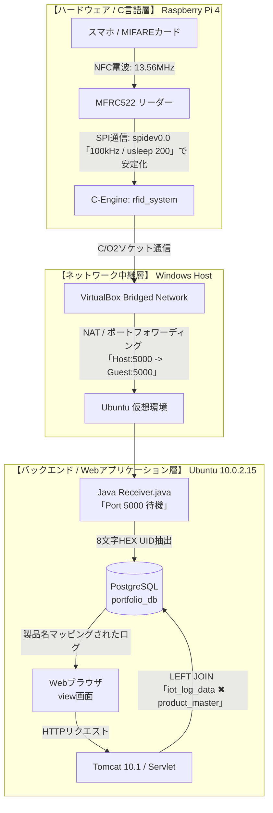

<b>【全体構成図】物理層(C言語)からWeb層(Java)までのデータ同期経路を表示</b>

# Multi-Layer IoT RFID Logging & Mapping System
本プロダクトは、ICカードリーダー（Raspberry Pi 4 / C言語）からデータを受け取るサーバー（Java）、データを保存するデータベース（PostgreSQL）、そしてブラウザに表示するWeb画面（Tomcat / サーブレット）までを、すべて1人で繋ぎ合わせて自作したフルスタックのIoTシステムです。単にデータを横流しするだけのシステムではありません。「センサーがデータを読み取れない」「ノイズでデータが溢れかえる」といった、ハードウェアとWebシステムの間で発生する実務的な通信バグを自力で波形・ログから突き止め、ビット単位のレジスタ制御で解決しています。

## 開発時に苦労したバグと、その解決実績

ハードウェア（C言語）とWeb（Java）の速度差に起因する不具合を、データシートに基づくレジスタ制御で解決しました。

### 1. カードリーダーのデータ読み取りエラー解消
* **課題：** C言語の処理が速く、カードリーダーの準備完了前に命令を送ったことで読み取りエラーが発生。
* **解決：** 命令送信後に `usleep(200);` でウェイトを入れ、機械側の処理を待機させて検知率100%を達成。

### 2. レジスタ制御によるノイズ・データ flood の停止
* **課題：** ループ処理中に設定メモリのデータがズレて大量のゴミデータが発生。
* **解決：** 通信ごとにレジスタを明示的に初期化（0x07/0x00制御）し、ノイズをデータと誤認する挙動をシャットアウト。

### 3. 商品名が画面に連動しないバグの修正
* **課題：** Java側で付与した不要なデータが混入し、データベース内の商品マスタと一致せず表示エラーが発生。
* **解決：** Java側で文字のクレンジング処理を実装し、純粋なカード番号のみを抽出してDBへリアルタイム連動させました。
