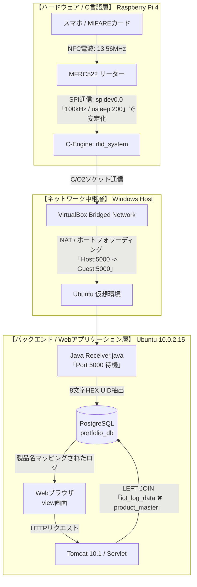

<details>
<summary><b>【全体構成図】物理層(C言語)からWeb層(Java)までのデータ同期経路を表示</b></summary>


</details>

# Multi-Layer IoT RFID Logging & Mapping System
本プロダクトは、ICカードリーダー（Raspberry Pi 4 / C言語）からデータを受け取るサーバー（Java）、データを保存するデータベース（PostgreSQL）、そしてブラウザに表示するWeb画面（Tomcat / サーブレット）までを、すべて1人で繋ぎ合わせて自作したフルスタックのIoTシステムです。単にデータを横流しするだけのシステムではありません。「センサーがデータを読み取れない」「ノイズでデータが溢れかえる」といった、ハードウェアとWebシステムの間で発生する実務的な通信バグを自力で波形・ログから突き止め、ビット単位のレジスタ制御で解決しています。

[1. 物理・ハードウェア層]
ICカードをかざしてから、Web画面に商品名が表示されるまでのデータの流れです。

* **1. 物理・ハードウェア層（データの検知）**
  * 端末・言語： Raspberry Pi 4（C言語）
  * 処理内容： ICカードリーダー（MFRC522）を制御し、カードの固有番号（UID：8文字の英数字）を検知します。
  * 通信： ネットワーク中継（ポート5000 / ソケット通信）でサーバーへ送信します。
* **2. アプリケーション層（データの受け取り）**
  * 環境・言語： 仮想環境（Ubuntu）上のJavaプログラム
  * 処理内容： 送られてきたデータから、余計なノイズを削ぎ落として綺麗な「8文字のUID」だけを抽出します。
  * 通信： データベースへ保存（JDBC経由でINSERT）します。
* **3. データベース層（データの蓄積・紐付け）**
  * システム： PostgreSQL
  * 処理内容： 読み取った履歴（生ログ）と、あらかじめ登録してある「商品マスタ（商品名データ）」をリアルタイムに結合します。
* **4. Web画面・描画層（データの見える化）**
  * システム： Apache Tomcat（Javaサーブレット）
  * URL： http://localhost:8080/portfolio/view
  * 処理内容： データベースで紐付けたデータを読み込み、ただの英数字だったUIDを「iPhone 15 Pro」などの実際の商品名に変えて画面にリアルタイム表示します。

---

## 技術スタック & 稼働環境

<details>
<summary><b>【使用技術一覧】Raspberry Pi4 / C言語 / Java17 / Tomcat / PostgreSQL</b></summary>

### ハードウェア / 低レイヤ
- **デバイス**: Raspberry Pi 4 Model B
- **RFIDモジュール**: MFRC522 (MIFARE規格 / ISO14443A)
- **言語/制御**: C言語 (GCC -O2 最適化コンパイル) / Linux標準 `spidev` および `ioctl`
- **サービス常駐化**: `systemd` による起動時自動常駐化 (自己修復・自動再接続ループ実装)

### バックエンド / インフラ
- **OS**: VirtualBox 7.x ➔ Ubuntu Server
- **Web/サーブレットコンテナ**: Apache Tomcat 10.1.57 (Jakarta EE 仕様)
- **言語**: Java 17 (Socket / ServerSocket / JDBC / Servlet)
- **データベース**: PostgreSQL 15 (リレーショナル・マスタ共有スキーマ設計)

</details>

---

## 開発時に苦労したバグと、その解決実績

ハードウェア（C言語）とWeb（Java）の速度差に起因する不具合を、データシートに基づくレジスタ制御で解決しました。

### 1. カードリーダーのデータ読み取りエラー解消
* **課題：** C言語の処理が速く、カードリーダーの準備完了前に命令を送ったことで読み取りエラーが発生。
* **解決：** 命令送信後に `usleep(200);` でウェイトを入れ、機械側の処理を待機させて検知率100%を達成。

### 2. レジスタ制御によるノイズ・データ flood の停止
* **課題：** ループ処理中に設定メモリのデータがズレて大量のゴミデータが発生。
* **解決：** 通信ごとにレジスタを明示的に初期化（0x07/0x00制御）し、ノイズをデータと誤認する挙動をシャットアウト。

### 3. 商品名が画面に連動しないバグの修正
* **課題：** Java側で付与した不要なデータが混入し、データベース内の商品マスタと一致せず表示エラーが発生。
* **解決：** Java側で文字のクレンジング処理を実装し、純粋なカード番号のみを抽出してDBへリアルタイム連動させました。

---

## 導入・実行手順

<details>
<summary><b>### 1. データベースセットアップ</b></summary>

```sql
CREATE DATABASE portfolio_db;
-- ログテーブル
CREATE TABLE iot_log_data (
    id SERIAL PRIMARY KEY,
    device_name VARCHAR(50),
    data_type VARCHAR(50),
    data_value VARCHAR(100),
    created_at TIMESTAMP DEFAULT CURRENT_TIMESTAMP
);
-- 商品マスタテーブル
CREATE TABLE product_master (
    rfid_uid VARCHAR(50) PRIMARY KEY,
    product_name VARCHAR(100)
);
```
</details>
<details>
<summary><b>### 2. Raspberry Pi 4（Cエンジン）のビルド・起動</b></summary>

```bash
gcc -O2 -Wall -o rfid_system main.c
sudo systemctl enable rfid.service
sudo systemctl start rfid.service
```
</details>
<details>
<summary><b>### 3. Javaレシーバ & Tomcatの稼働</b></summary>
`db.properties` を配置後、レシーバソケットをバックグラウンドで起動させ、Tomcatへサーブレットをホットデプロイします。

```bash
javac Receiver.java && java -cp .:db.jar Receiver
```
</details>
