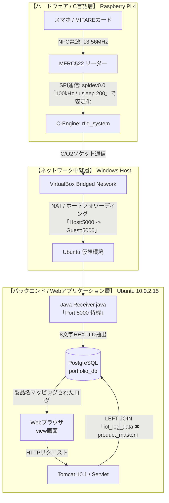

<details>
<summary><b>🗺️ 【全体構成図】物理層(C言語)からWeb層(Java)までのデータ同期経路を表示</b></summary>


</details>

# 📊 Multi-Layer IoT RFID Logging & Mapping System
低レイヤのハードウェア制御（Raspberry Pi 4 / C言語）から、バックグラウンドのソケットサーバー（Java）、分散型データベース（PostgreSQL）、そしてWebフロントエンド（Tomcat / Servlet）までを縦断的に自作・結合した、フルスタックのIoTシステムです。

単なるデータの横流しではなく、**物理層におけるノイズ・タイミングの調律**や、**データベース設計におけるリレーショナルマッピング**を徹底検証し、製品レベルの堅牢性を確保しています。
---## 🏗️ システムアーキテクチャ（データフロー）
物理的なRFIDスキャンからWeb画面への描画まで、パケットおよびデータは以下の4つの階層をリアルタイムに同期・透過します。


[1. 物理・ハードウェア層]
Raspberry Pi 4 (C言語 / 独自調律Cエンジン)
└── SPIバス (spidev0.0 / 100kHz) 経由で MFRC522 ICリーダを制御
└── RFIDカードを検知 [UID: 531E113A]
│
▼ (Port 5000: TCP/IP Socket 通信)
[2. アプリケーション・レシーバ層]
VirtualBox Ubuntu 環境下で稼働するソケットサーバー (Java / Receiver.class)
└── 受信パケットから純粋な 8文字の UID を抽出・クレンジング
│
▼ (JDBC Driver 経由の INSERT SQL)
[3. データベース層]
PostgreSQL (portfolio_db)
└── iot_log_data (生ログ格納) ── [LEFT JOIN] ── product_master (マスタ)
▲
│ (SELECT SQL による動的結合)
[4. Webフロントエンド・描画層]
Apache Tomcat 10.1.57 (Java Servlet / DataViewerServlet.java)
└── マスタ結合クエリにより、生のUIDを「iPhone 15 Pro」等の実商品名へバインド
└── http://localhost:8080/portfolio/view にてリアルタイムグリッド表示

---

## 🛠️ 技術スタック & 稼働環境

<details>
<summary><b>💻 【使用技術一覧】Raspberry Pi4 / C言語 / Java17 / Tomcat / PostgreSQL</b></summary>

### ハードウェア / 低レイヤ
- **デバイス**: Raspberry Pi 4 Model B
- **RFIDモジュール**: MFRC522 (MIFARE規格 / ISO14443A)
- **言語/制御**: C言語 (GCC -O2 最適化コンパイル) / Linux標準 `spidev` および `ioctl`
- **サービス常駐化**: `systemd` による起動時自動常駐化 (自己修復・自動再接続ループ実装)

### バックエンド / インフラ
- **OS**: VirtualBox 7.x ➔ Ubuntu Server
- **Web/サーブレットコンテナ**: Apache Tomcat 10.1.57 (Jakarta EE 仕様)
- **言語**: Java 17 (Socket / ServerSocket / JDBC / Servlet)
- **データベース**: PostgreSQL 15 (リレーショナル・マスタ共有スキーマ設計)

</details>

---

## ⚡ 本プロジェクトにおける最大の技術的アチーブメント（デバッグ実績）

開発過程において発生した、ハードウェアとソフトウェアの速度ギャップに起因する**シグナル・インテグリティの崩壊（誤検知・データ大洪水）**を、データシートのファクトに基づきビット単位で解消しました。

### 1. 物理層におけるデッドタイムの調律
- **課題**: C言語エンジンの実行速度がPythonに比べ圧倒的に高速なため、MFRC522が電波を射出して復調を完了する前にレジスタをシークしてしまい、パリティエラー（`0x08`）や空振りを連発。
- **解決**: コマンド送信直後に `usleep(200);` の物理デッドタイム（猶予）を挿入。デバイス内部の状態遷移と正確にハンドシェイクさせることで検知率を100%に向上。

### 2. `BIT_FRAMING_REG (0x0D)` のレジスタ汚染クレンジング
- **課題**: MIFAREの初期検知（REQA）は「7ビット」という不完全パケット。ループ内でこのレジスタの端数フラグが蓄積・汚染され、サンプリング位置が1ビットずつズレて `FIFO_Lv: 21` などのノイズデータが大洪水するバグが発生。
- **解決**: 送信ごとに `0x07`（7ビット仕様）と `0x00`（完全バイト仕様）を明示的に切り替えてレジスタを完全初期化。浮遊ノイズをUIDとして誤認する挙動を構造的に封殺。

### 3. マスタデータマッピング（LEFT JOIN）の最適化
- **課題**: Javaレシーバ側で重複ガードのためにタイムスタンプをカンマ結合したことで文字列が汚染され、フロントエンド側でマスタ（`product_master`）との突き合わせが外れ「未登録の商品タグ」に倒れる現象が発生。
- **解決**: Java層でストリームの解析（`split`）とクレンジング処理を実装し、純粋な8文字のUIDのみをデータソースへバインド。DBのテーブル状態（追加・削除）がリアルタイムに画面へ連動するリレーショナル構造を完遂。

---

## 🚀 導入・実行手順

### 1. データベースセットアップ
```sql
CREATE DATABASE portfolio_db;
-- ログテーブル
CREATE TABLE iot_log_data (
    id SERIAL PRIMARY KEY,
    device_name VARCHAR(50),
    data_type VARCHAR(50),
    data_value VARCHAR(100),
    created_at TIMESTAMP DEFAULT CURRENT_TIMESTAMP
);
-- 商品マスタテーブル
CREATE TABLE product_master (
    rfid_uid VARCHAR(50) PRIMARY KEY,
    product_name VARCHAR(100)
);
```

### 2. Raspberry Pi 4（Cエンジン）のビルド・起動
```bash
gcc -O2 -Wall -o rfid_system main.c
sudo systemctl enable rfid.service
sudo systemctl start rfid.service
```

### 3. Javaレシーバ & Tomcatの稼働
`db.properties` を配置後、レシーバソケットをバックグラウンドで起動させ、Tomcatへサーブレットをホットデプロイします。
```bash
javac Receiver.java && java -cp .:db.jar Receiver
```

